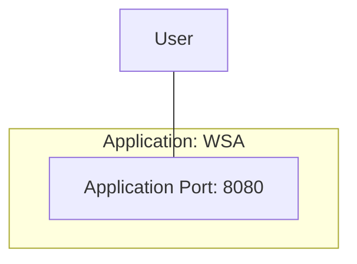

# EG Web Server


## How
```Bash
source etc/config
```

### Compile and Test
```Bash
mvn clean verify
```

### Maven Start Serving
```Bash
xt mvn spring-boot:run
```

### Browse
```Bash
http GET localhost:8080
```

### Maven Stop Serving
```Bash
psef xterm.+mvn.spring.boot.run --kill
```

### Java Start Serving
```Bash
xt java -jar target/eg-web-server-0.0.0.jar
```

### Browse
```Bash
http GET localhost:8080/hostname
```

### Java Stop Serving
```Bash
psef xterm.+java..jar.target.eg.web.server.0.0.0.jar --kill
```


## What


### End Points
| Protocol | Method | End Point | Req Head    | Req Body | Res Head | Res Body           |
|----------|--------|-----------|-------------|----------|----------|--------------------|
| HTTP     | GET    | /         | -           | -        | -        | `EndPointList`     |
| HTTP     | GET    | /hostname | `RequestId` | -        | -        | `HostNameResponse` |

### Types

    RequestId = String;
    EndPointList = [String];
    HostNameResponse = {colour: String, hostname: String, requestId: String}.

*2023-12-02*
