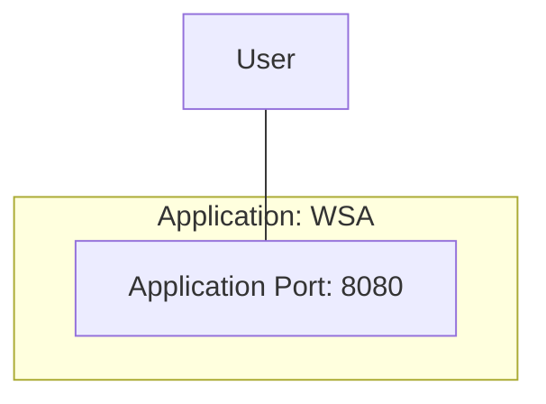

# [EG Web Server](../README.md): Application


## How
```Bash
source etc/config
```

### Compile and Test
```Bash
mvn clean verify
```

### Maven Start Serving
```Bash
xt mvn spring-boot:run
```

### Browse End-Points
```Bash
http GET localhost:8080
http GET localhost:8080/hostname Request-Id:4711
```

### Maven Stop Serving
```Bash
psef mvn.spring.boot.run --kill
```

### Java Start Serving
```Bash
xt java -jar target/web-server-application-0.2.0.jar --colour=magenta
```

### Load-Test End-Point
```Bash
loader-load-test 8080 hostname
```

### Check Logging
```Bash
loader-check-log
```

### Java Stop Serving
```Bash
psef java..jar.target.web.server.application.0.2.0.jar --kill
```

## What


### End Points
| Protocol | Method | End Point | Req Head    | Req Body | Res Head | Res Body           |
|----------|--------|-----------|-------------|----------|----------|--------------------|
| HTTP     | GET    | /         | -           | -        | -        | `EndPointList`     |
| HTTP     | GET    | /hostname | `RequestId` | -        | -        | `HostNameResponse` |

### Types

    RequestId = String;
    EndPointList = [String];
    HostNameResponse = {colour: String, hostname: String, requestId: String}.

*2023-12-02*
