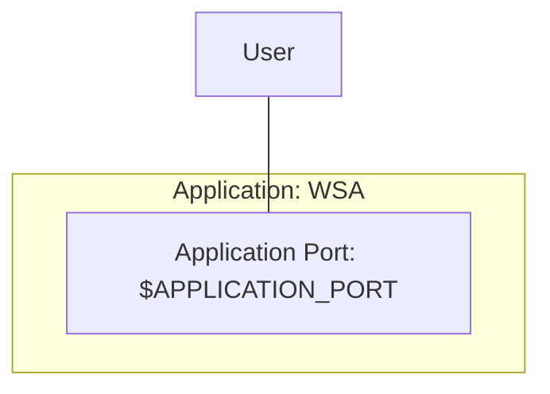

# [EG Web Server](../README.md): Application


## How

### Set Up
```Bash
source etc/config
export H=16 W=212
```
```Bash
mvn clean verify -Dspring.profiles.active=testing
```
```Bash
xt java -jar target/web-server-application-$APPLICATION_VERSION.jar --server.port=$APPLICATION_PORT --colour=$APPLICATION_COLOUR
```

### Verify
```Bash
http GET localhost:$APPLICATION_PORT
http GET localhost:$APPLICATION_PORT/hostname Request-Id:4711
```
```Bash
loader-get-local $APPLICATION_PORT hostname 3345
```
```Bash
H=32 W=48
xt "loader-chug-it $APPLICATION_PORT hostname 10 3"
```

### Tear Down
```Bash
psef loader.chug.it --kill
```
```Bash
psef web.server.application --kill
```

## What


### End Points
| Protocol | Method | End Point | Req Head    | Req Body | Res Head | Res Body           |
|----------|--------|-----------|-------------|----------|----------|--------------------|
| HTTP     | GET    | /         | -           | -        | -        | `EndPointList`     |
| HTTP     | GET    | /hostname | `RequestId` | -        | -        | `HostNameResponse` |

### Types

    RequestId = String;
    EndPointList = [String];
    HostNameResponse = {colour: String, hostname: String, requestId: String}.

*2023-12-02*
