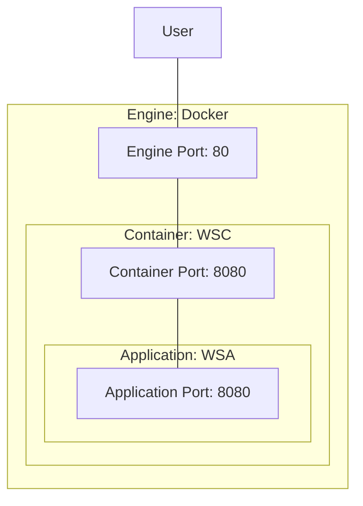

# [EG Web Server](../README.md): Container


## How
```bash
source etc/config
```

### Download Jar
```bash
download $WSA_REPO/web-server-application-0.2.0.jar src/tmp
```

### Build Image
```bash
docker-build-image 0.2.1
```

### Run Container (Start Serving)
```bash
xt docker-run-container wsc 80 8080 0.2.1
```

### Browse End-Points
```bash
http GET localhost
http GET localhost/hostname Request-Id:714
```

### Load-Test End-Point
```Bash
loader-load-test 80 hostname
```

### Check Log
```Bash
loader-check-log
```

### Stop Server
```bash
psef xterm.+docker.run.container --kill
```

### Pushing
```Bash
docker login --user=rik911
docker push rik911/web-server-container:0.2.1
```

### Removing
```bash
docker container remove wsc --force
docker image remove rik911/web-server-application:0.2.1
```


## What


*2023-12-02*
