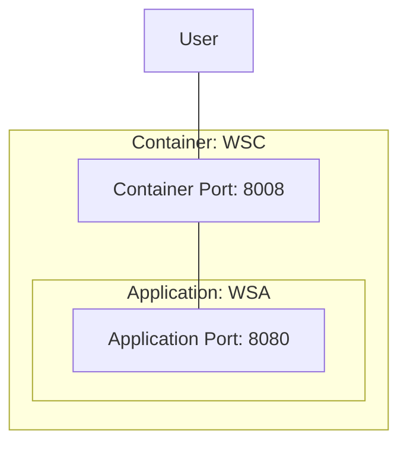

# [EG Web Server](../README.md): Container


## How

### Set Up
```bash
source etc/config
export H=32 W=142
```
```bash
xt + 'show_docker | heat'
```
```bash
start_docker
```
```bash
export JAR_REPO=../application/target
cp -pr $JAR_REPO/web-server-application-$APPLICATION_VERSION.jar src/tmp
```
```bash
docker build src --tag=rik911/web-server-container:$APPLICATION_VERSION --build-arg=VERSION=$APPLICATION_VERSION
```
```bash
H=16 W=212
xt docker run --tty --name=wsc\
 --expose=$CONTAINER_PORT\
 --publish=$CONTAINER_PORT:$APPLICATION_PORT\
 --env=COLOUR=$APPLICATION_COLOUR\
 --env=VERSION=$APPLICATION_VERSION\
 --env=SERVER_PORT=$APPLICATION_PORT\
 rik911/web-server-container:$APPLICATION_VERSION
H=96 W=48
```

### Verify
```Bash
loader-get-local $CONTAINER_PORT hostname 4263
```
```Bash
xt "loader-chug-it $CONTAINER_PORT hostname 100 5"
```
```Bash
docker push rik911/web-server-container:$APPLICATION_VERSION
```

### Tear Down
```Bash
docker container stop wsc
```
```bash
docker container remove wsc
```
```bash
docker image remove rik911/web-server-container:$APPLICATION_VERSION
```
```bash
stop_docker
```


## What


*2023-12-02*
