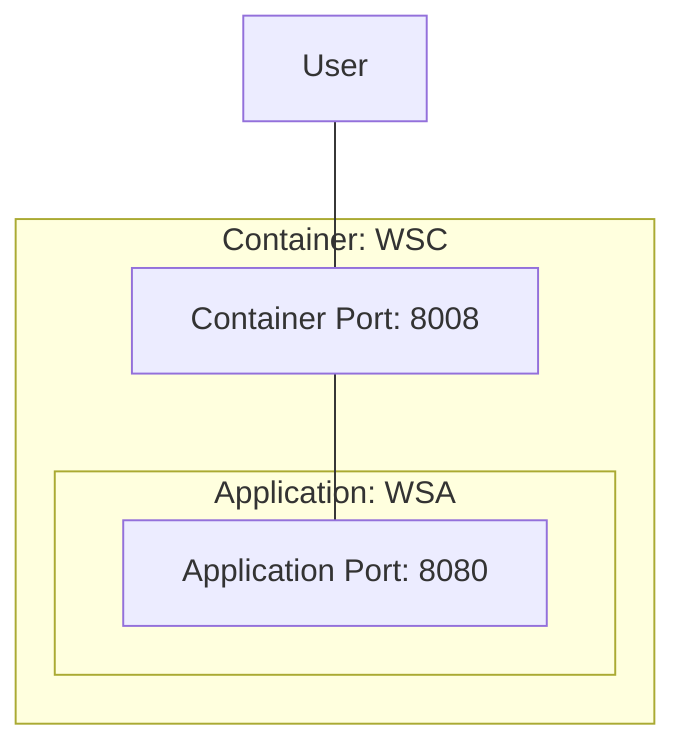

# [EG Web Server](../README.md): Container


## How

### Set Up
```bash
source etc/config
```
```bash
xt + show_docker
```
```bash
start_docker
```
```bash
cp -pr ../application/target/web-server-application-0.2.0.jar src/tmp
```
```bash
docker build src --tag=rik911/web-server-container:0.2.1 --build-arg=VERSION=0.2.0
```
```bash
xt docker run --tty --name=wsc --publish=8008:8080 rik911/web-server-container:0.2.1
```

### Verify
```Bash
loader-load-test 8008 hostname 100
```
```Bash
loader-check-log
```
```Bash
#docker login --user=rik911
docker push rik911/web-server-container:0.2.1
```

### Tear Down
```Bash
docker container stop wsc
```
```bash
docker container remove wsc
```
```bash
docker image remove rik911/web-server-container:0.2.1
```
```bash
stop_docker
```


## What


*2023-12-02*
