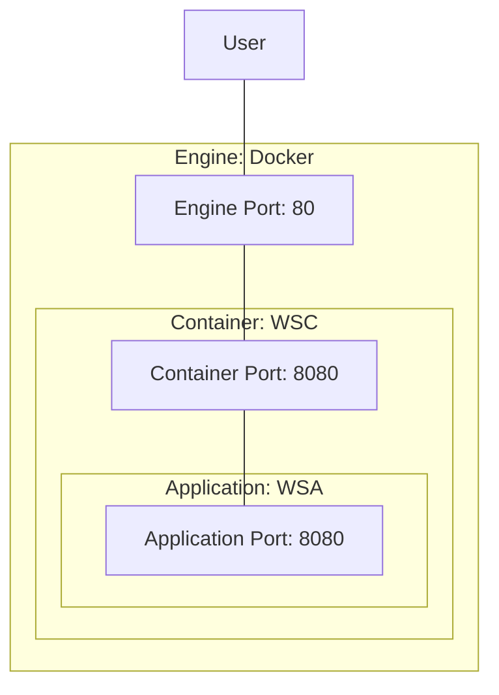

# [EG Web Server](../README.md): Container


## How
```bash
source etc/config
```

### Copy Jar
```bash
cp -pr ../application/target/web-server-application-0.2.0.jar src/tmp
```

### Build Image
```bash
docker build src --tag=rik911/web-server-container:0.2.1 --build-arg=VERSION=0.2.0
```

### Run Container (Start Serving)
```bash
xt docker run --tty --name=wsc --publish=80:8080 rik911/web-server-container:0.2.1
```

### Load-Test End-Point
```Bash
loader-load-test 80 hostname
```

### Check Logging
```Bash
loader-check-log
```

### Stop Server
```bash
psef web.server.container.0.2.1 --kill
```

### Pushing
```Bash
#docker login --user=rik911
docker push rik911/web-server-container:0.2.1
```

### Removing
```bash
docker container remove wsc --force
```
```bash
docker image remove rik911/web-server-container:0.2.1
```


## What


*2023-12-02*
