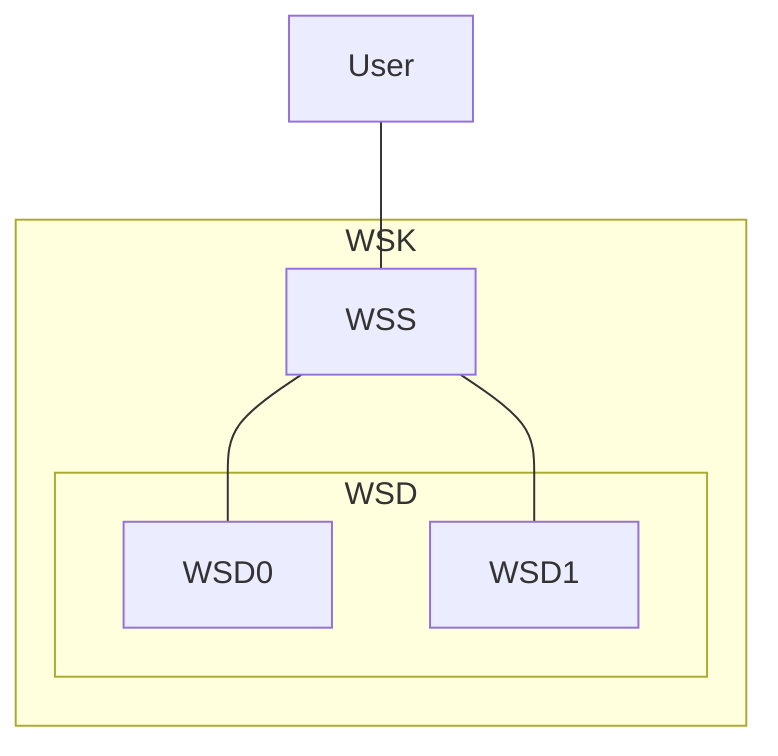

# [EG Web Server](../README.md): Kluster


## How

### Set-Up
```bash
clear
source etc/module
source etc/config
```
```bash
helm install wsk src --set=serverPort=9090
```
```bash
xt 'minikube service wss --url | tee wss-url'
```

### Load Test
```bash
export CLUSTER_PORT=$(cat wss-url | cut -d: -f3)
loader-load-test $CLUSTER_PORT hostname
```
```bash
loader-check-log
```

### Tear-Down
```bash
psef minikube.service.wss --kill
```
```bash
helm uninstall wsk
```
```bash
monitor_stop
tunnel_stop
```
```bash
minikube_stop
docker_stop
```


## What


*2023-12-03*
