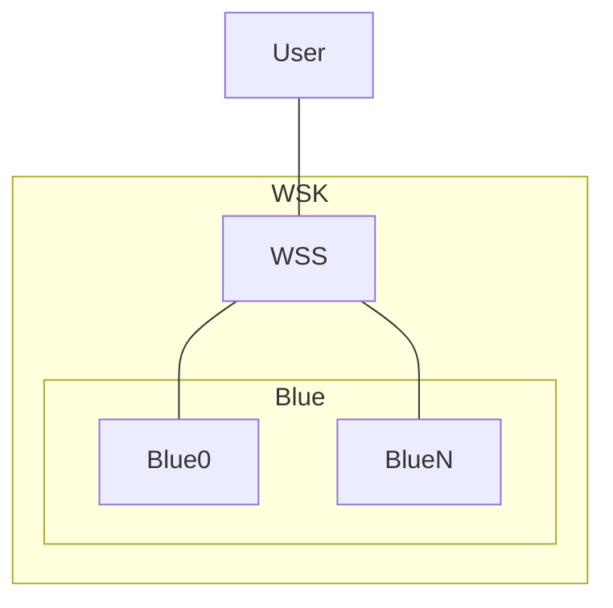
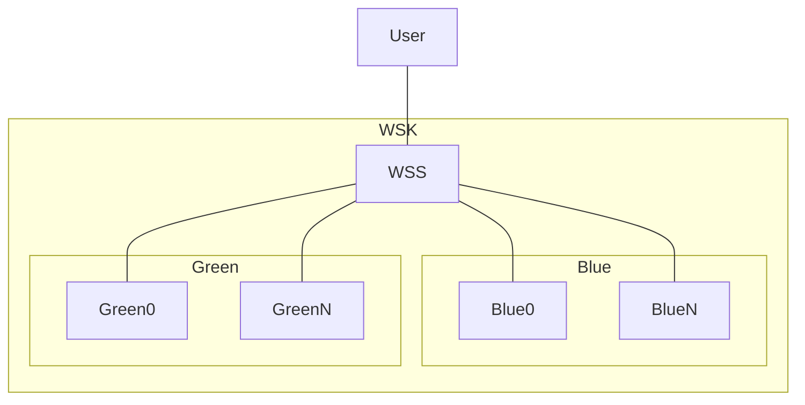
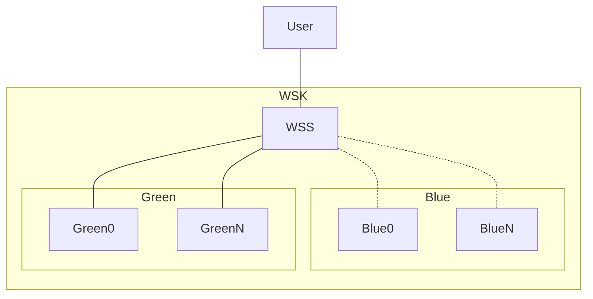

# [EG Web Server](../README.md): Kluster


## How

### Set-Up
```bash
source etc/config
export H=32 W=142
# update kluster versions based on application version
```
```bash
xt + 'show_docker | heat'
```
```bash
xt + 'show_kubernetes | heat'
```
```bash
start_docker
```
```bash
start_minikube
```
```bash
H=8 W=142
start_tunnel
H=96 W=48
```
Run this at the end of each paragraph, below
```bash
xt "loader-chug-it $KLUSTER_NODE_PORT hostname 100 5"
```

### First Service: Blue
Blue
```bash
helm install blue src/deployment --values=src/values.yaml --values=src/blue.yaml
```
```bash
helm install wss src/service --values=src/values.yaml --values=src/blue.yaml
```

### Second Service: Green
Cyan
```bash
helm install green src/deployment --values=src/values.yaml --values=src/green.yaml
```
```bash
helm upgrade wss src/service --values=src/values.yaml --values=src/cyan.yaml
```
Green
```bash
helm upgrade wss src/service --values=src/values.yaml --values=src/green.yaml
```

### Third Service: Blue
Cyan
```bash
helm upgrade blue src/deployment --values=src/values.yaml --values=src/blue.yaml
```
```bash
helm upgrade wss src/service --values=src/values.yaml --values=src/cyan.yaml
```
Blue
```bash
helm upgrade wss src/service --values=src/values.yaml --values=src/blue.yaml
```

### Summary

    helm install deployment blue   #
    helm install service blue      # v0
    helm install deployment green  #
    helm upgrade service cyan      # v0 and v1
    helm upgrade service green     # v1
    helm upgrade deployment blue   #
    helm upgrade service cyan      # v1 and v2
    helm upgrade service blue      # v2
    helm upgrade deployment green  #
    ...

Try this later
```bash
xt + 'loader-load-test $KLUSTER_NODE_PORT hostname 500; sleep 30; loader-check-log'
```
```bash
helm upgrade wss src/service --values=src/values.yaml --values=src/cyan.yaml
```

### Tear-Down
```bash
helm uninstall wss
helm uninstall blue
helm uninstall green
```
```bash
stop_tunnel
```
```bash
stop_minikube
```
```bash
stop_docker
```


## What

### Initial Service


### Blue Service


### Cyan Service


### Green Service


*2023-12-03*
