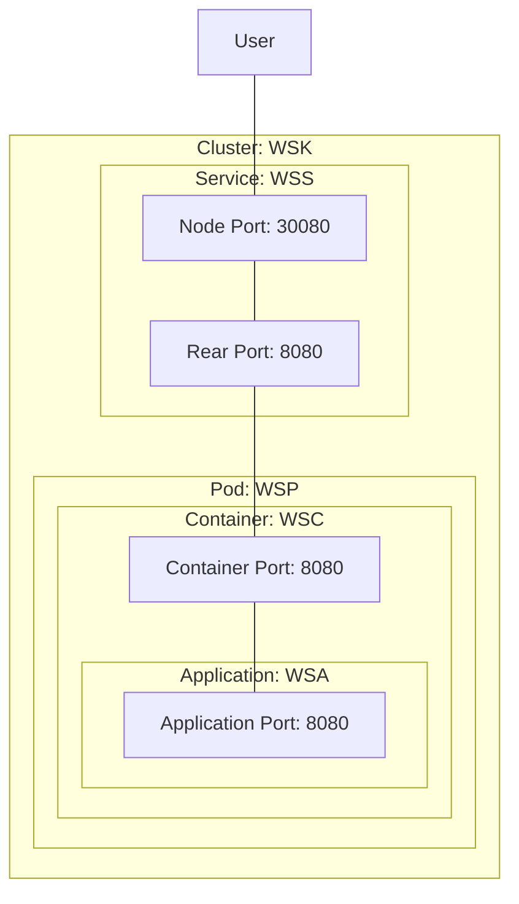

# [EG Web Server](../README.md): Kluster


## How
```bash
clear
source etc/module
source etc/config
```
```bash
helm install wsk src
```
```bash
xt 'minikube service wss --url | tee wss-url'
```
```bash
export CLUSTER_PORT=$(cat wss-url | cut -d: -f3)
loader-load-test $CLUSTER_PORT hostname
```
```bash
loader-check-log
```
```bash
psef minikube.service.wss --kill
```
```bash
helm uninstall wsk
```
```bash
monitor_stop
tunnel_stop
```
```bash
minikube_stop
docker_stop
```


## What


### Note
* `service.wss.spec.ports[0].targetPort` ~ Container Port
* `service.wss.spec.ports[0].port` ~ Rear Port
* `service.wss.spec.ports[0].nodePort` ~ Node Port (dynamic, minikube tunnel-service)
* `kubectl get service/wss --output=yaml | yq '.metadata.annotations."meta.helm.sh/release-name"'` = `wsk`
* `kubectl get pod/wsp --output=yaml | yq '.metadata.annotations."meta.helm.sh/release-name"'` = `wsk`

*2023-12-03*
