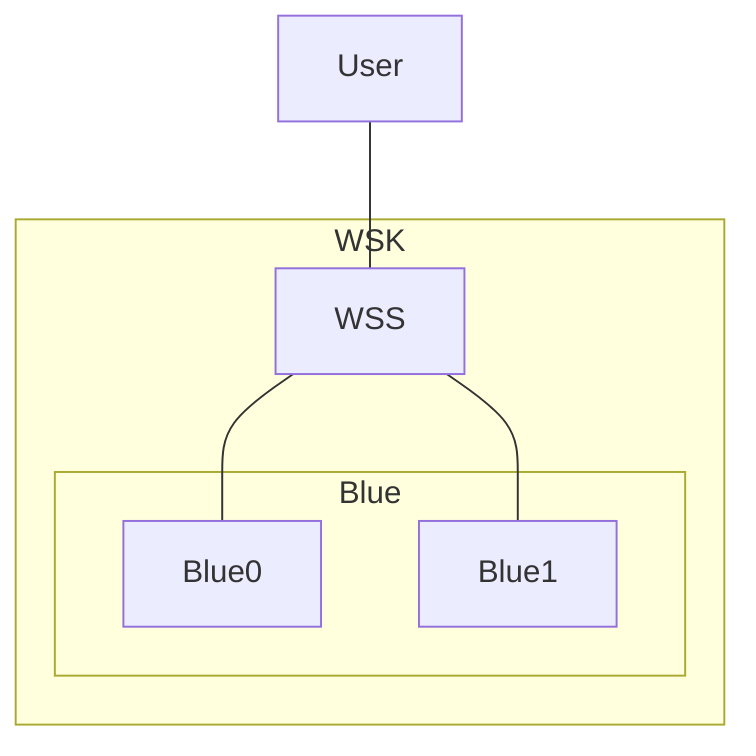
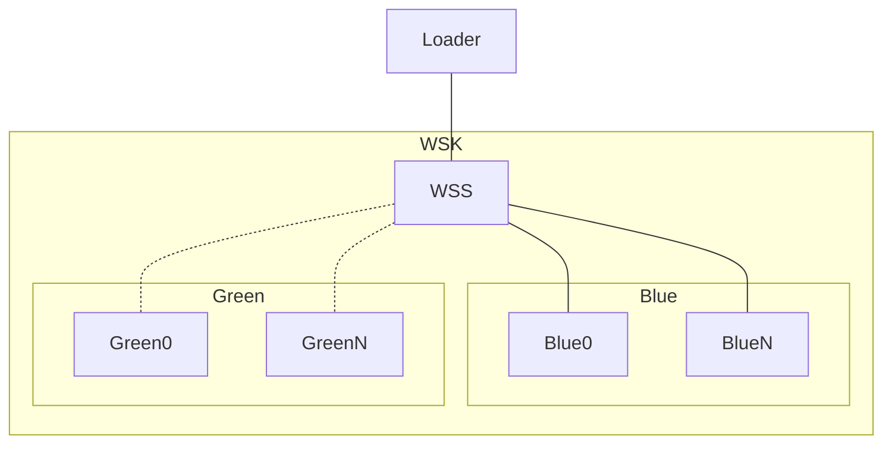
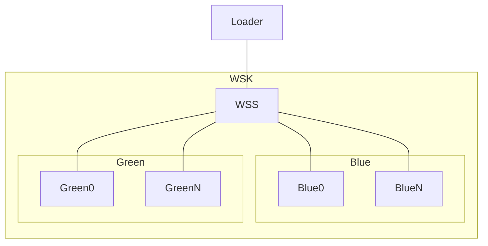
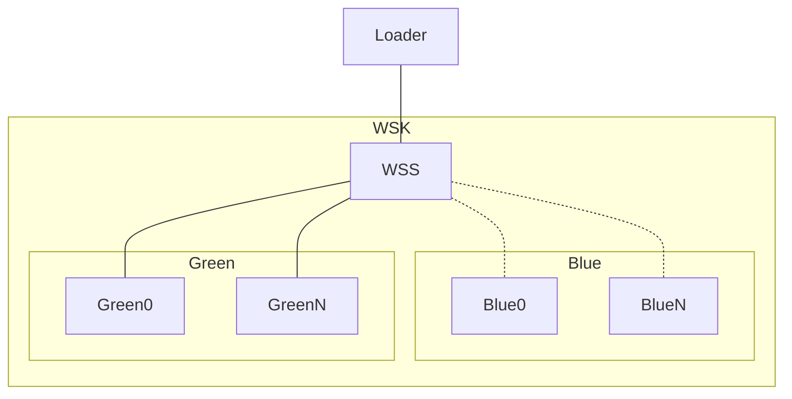

# [EG Web Server](../README.md): Kluster


## How

### Set-Up
```bash
clear
source etc/module
source etc/config
```

### First: Blue Service
```bash
helm install blue src/deployment --values=src/values.yaml --values=src/blue.yaml
```
```bash
helm install wss src/service --values=src/values.yaml --values=src/blue.yaml
```
```bash
loader-load-test 7070 hostname 100
```
```bash
loader-check-log
```

### Second: Cyan Service
```bash
helm install green src/deployment --values=src/values.yaml --values=src/green.yaml
```
```bash
helm upgrade wss src/service --values=src/values.yaml --values=src/cyan.yaml
```
```bash
loader-load-test 7070 hostname 100
```
```bash
loader-check-log
```

### Third: Green Service
```bash
helm upgrade wss src/service --values=src/values.yaml --values=src/green.yaml
```
```bash
loader-load-test 7070 hostname 100
```
```bash
loader-check-log
```

### Fourth: Cyan Service
```bash
helm upgrade blue src/deployment --values=src/values.yaml --values=src/blue.yaml
```
```bash
helm upgrade wss src/service --values=src/values.yaml --values=src/cyan.yaml
```
```bash
loader-load-test 7070 hostname 100
```
```bash
loader-check-log
```

### Fifth: Blue Service
```bash
helm upgrade wss src/service --values=src/values.yaml --values=src/blue.yaml
```
```bash
loader-load-test 7070 hostname 100
```
```bash
loader-check-log
```

### Tear-Down
```bash
helm uninstall wss
helm uninstall blue
helm uninstall green
```
```bash
monitor_stop
tunnel_stop
```
```bash
minikube_stop
docker_stop
```


## What

### Initial Service


### Blue Service


### Cyan Service


### Green Service


*2023-12-03*
