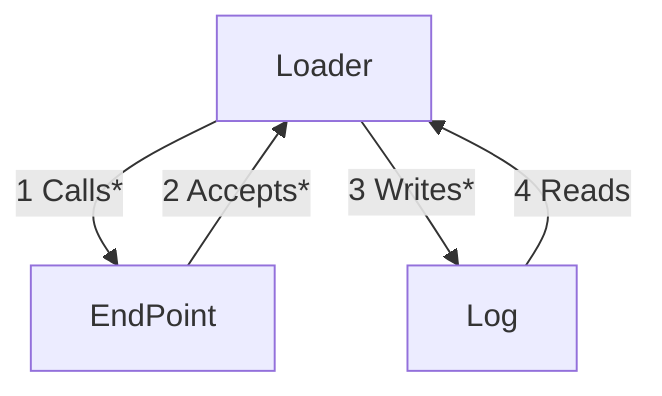

# [EG Web Server](../README.md): Loader


## How
```bash
source etc/config
```

### Start Serving
```bash
xt mock-server-start
```

### Browse
```bash
http GET localhost:8080
```

### Get Local Hostname
```bash
loader-get-local
```

### Load-Test Hostname
```bash
clear
loader-load-test
```

### Check Logging
```bash
loader-check-log
```

### Stop Serving
```bash
mock-server-stop
```

## What


### Scripts
[mock-server-start](bin/mock-server-start)
* spawns shell
* listens on port 8080
* responds with HostnameResponse

[mock-server-stop](bin/mock-server-stop)
* kills any running mock server

[loader-load-test](bin/loader-load-test) $PORT $END_POINT $COUNT
* writes to console
* generates $COUNT request ids
* invokes *loader-get-local*

[loader-get-local](bin/loader-get-local) $PORT $END_POINT $REQUEST_ID
* calls no-content end point
* accepts header+JSON response
* writes to log

[loader-check-logging](bin/loader-check-logging)
* reads from log
* writes to console

*2023-12-05*
