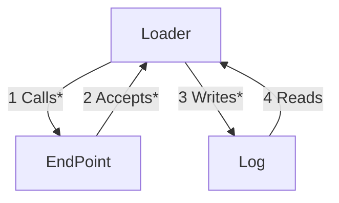

# [EG Web Server](../README.md): Loader


## How

### Set Up
```bash
source etc/config
```
```bash
xt mock-server-start
```

### Verify
```bash
http GET localhost:9999
```
```bash
loader-get-local 9999
```
```bash
loader-load-test 9999
```
```bash
loader-check-log
```

### Tear Down
```bash
mock-server-stop
```

## What


### Scripts
[mock-server-start](bin/mock-server-start)
* blocks process
* listens on port 9999
* responds with HostnameResponse

[mock-server-stop](bin/mock-server-stop)
* kills any running mock server

[loader-load-test](bin/loader-load-test) $PORT $END_POINT $COUNT
* writes to console
* generates $COUNT request ids
* invokes *loader-get-local*

[loader-get-local](bin/loader-get-local) $PORT $END_POINT $REQUEST_ID
* calls no-content end point
* accepts header+JSON response
* writes to log

[loader-check-logging](bin/loader-check-logging)
* reads from log
* writes to console

*2023-12-05*
